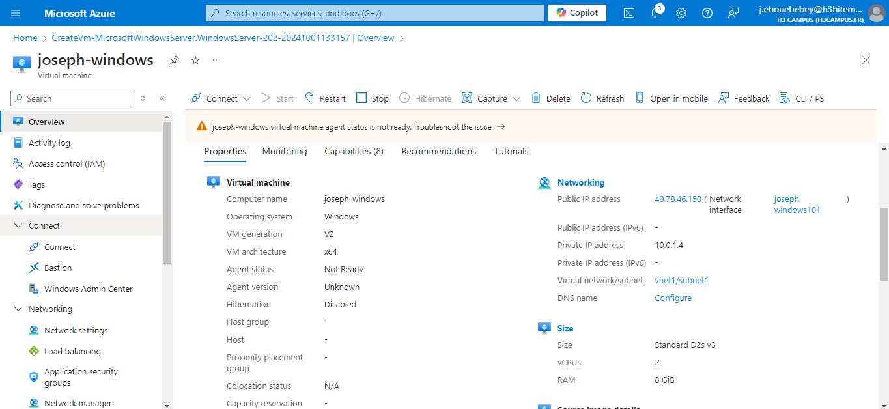
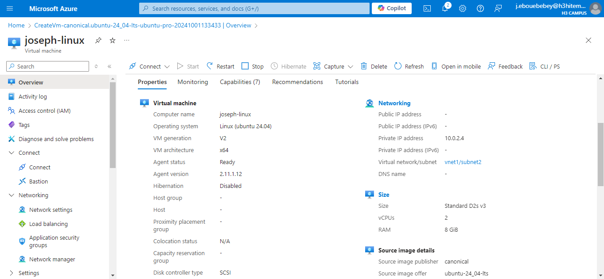
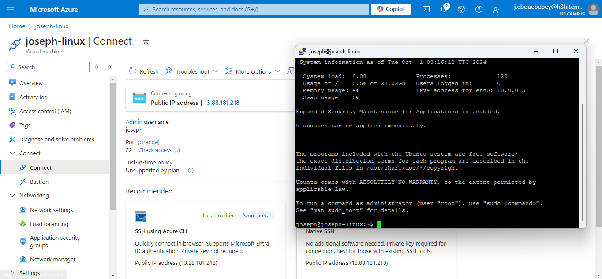
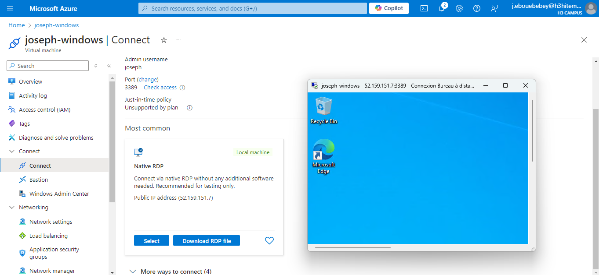

# LAB 1 - Creating and Managing Azure Virtual Machines
## Deploy a Windows and a Linux virtual machine (VM) in Azure.
After connecting to [Microsoft Azure](https://portal.azure.com/#home) i started by creating new resources

### Windows virtual machine
  

### Linux virtual machine
  

### SSH (Secure Shell) connect
To connect to linux through SSH i used [putty](https://www.putty.org/)
Here is the result 


### RDP (Remote Desktop Protocol) connect
This is the result of windows remote control after configurations


## On CLI
### Deploy a Virtual Machine
```bash
az login
```
### Create a Resource Group
```bash
az group create --name FINOPS --location eastus
```
### Create a Windows VM
### Allow RDP/SSH Access