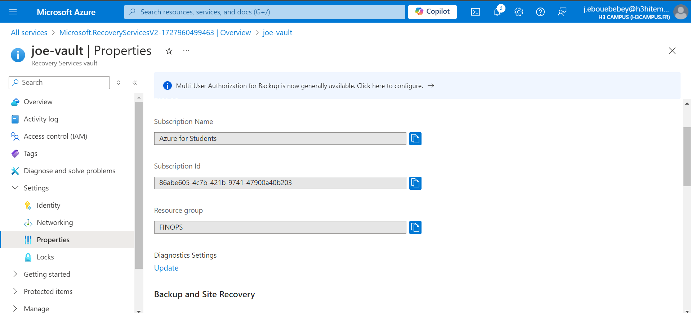
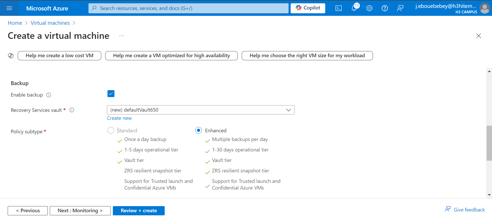
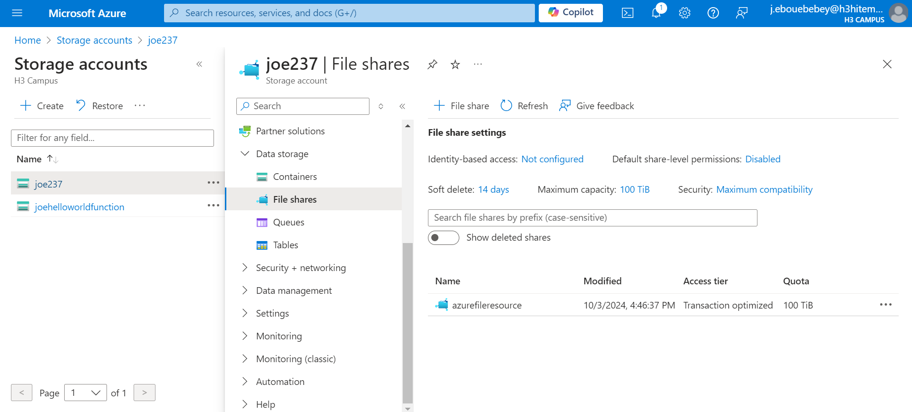
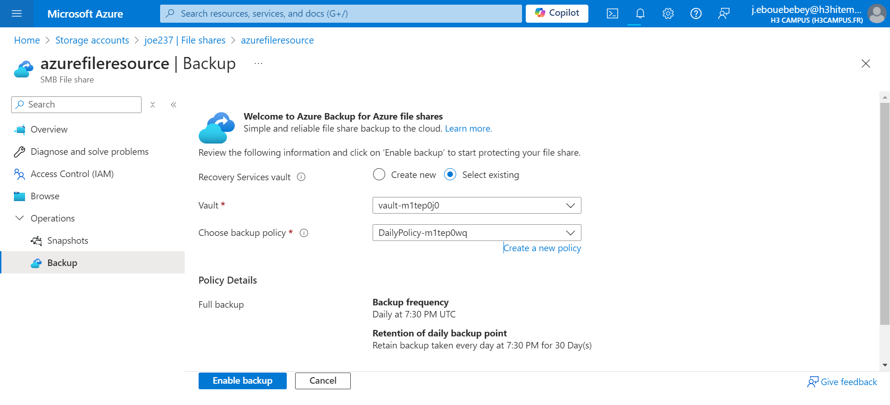
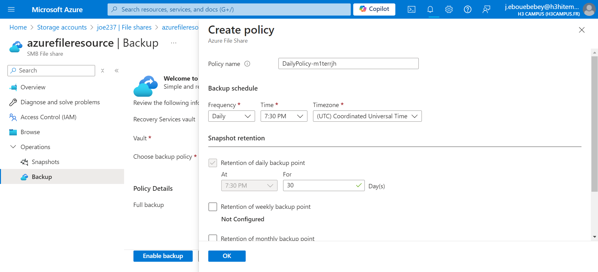
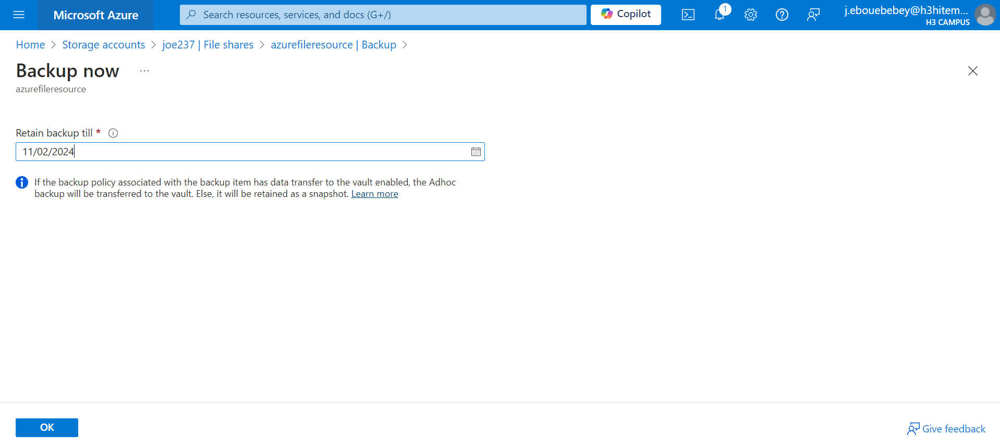

# Lab 10: Configuring Azure Backup and Recovery Services
## Step 1 : Create a Recovery Services Vault
After logging in, Search for Recovery Services Vault and create a new vault

## Step 2 : Configure Backup for VMs

## Step 3 : Configure Backup for Azure Files
The following shows how i can configure backup for individual file shares from the respective file share blade:

## Step 3 : Perform Backup and Restore Operations
To run an on-demamd backup, follow these steps:
Open the file share’s Overview blade for which you want to take an on-demand backup.
Under the Operation section, select Backup.
The context blade appears on the right that lists Vault Essentials. Select Backup Now to take an on-demand backup.

