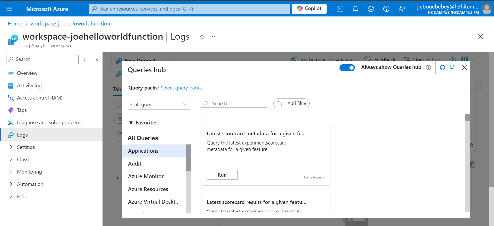
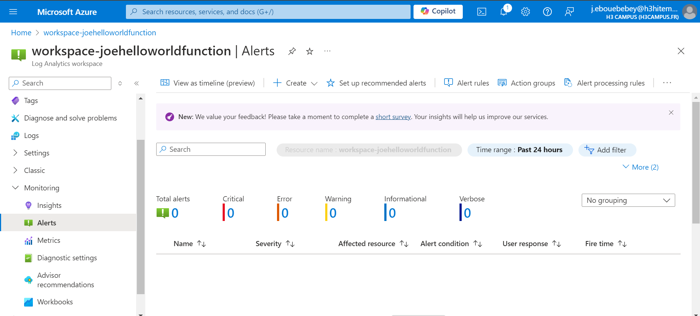

# Lab 11: Implementing Azure Monitor and Alerts
Azure Monitor helps you maximize the availability and performance of your applications and services by collecting, analyzing, and acting on telemetry data. In this lab, you will configure Azure Monitor to collect metrics and logs, create alerts based on metrics, visualize the data using Azure dashboards, and configure Action Groups for notification purposes.

#### Prerequisites
- An active Azure Subscription.
- Basic knowledge of Azure services and monitoring tools.
- Access to the Azure Portal.
## Step 1 : Set up Azure Monitor to Collect Metrics and Logs 
- Log in to the Azure Portal:
- Navigate to Azure Monitor:
- Enable Diagnostic Settings:

## Step 2 : Create alerts based on resource metrics
- Go to Azure Monitor Alerts
- Define the Alert Rule

- Create the Alert

## Step 3 : Visualize Data Using Azure Dashboards
- Create a New Dashboard

- Add Metrics and Logs

- Customize the Dashboard

- Share the Dashboard

## Step 4 : Implement Action Groups for alert notifications
- Create an Action Group

- Configure the Action Group
- Test the Action Group through email

