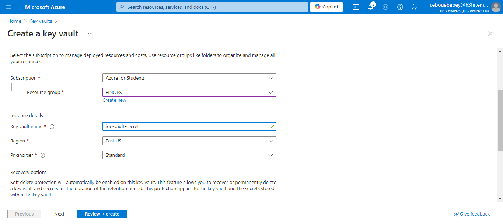
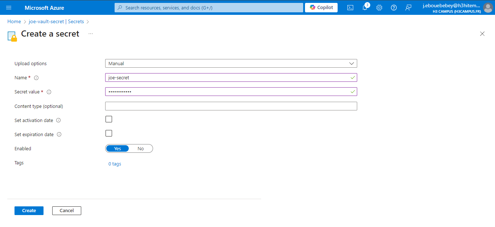

# Lab 13: Implementing Azure Key Vault 

## Step 1: Create an Azure Key Vault
- Azure Portal → Search Key Vault → Create.
- Choose Subscription, Resource Group, Region, and Pricing tier.
- Click Review + Create.


## Step 2: Store Secrets, Keys, and Certificates
- Store a Secret:
    Key Vault → Secrets → + Generate/Import → Name/Value → Create
- Store a Key:
    Key Vault → Keys → + Generate/Import → Name/Key Type → Create
- Store a Certificate:
    Key Vault → Certificates → + Generate/Import → Name → Create


## Step 3: Integrate Key Vault with an Application for Secret Management
- Create an Application (e.g., ASP.NET Core):
    You can create a simple ASP.NET Core application using Visual Studio or the .NET CLI.
- Add NuGet Packages:
```bash
    dotnet add package Azure.Identity
    dotnet add package Azure.Security.KeyVault.Secrets
```
- Set Up Azure Key Vault in Your Application
```bash
    using Azure.Identity;
    using Azure.Security.KeyVault.Secrets;

        public class Program
    {
        public static void Main(string[] args)
        {
            var kvUri = "https://<YourKeyVaultName>.vault.azure.net/";
            var client = new SecretClient(new Uri(kvUri), new DefaultAzureCredential());

            KeyVaultSecret secret = client.GetSecret("MySecret");
            Console.WriteLine($"Secret Value: {secret.Value}");
        }
    }
```
- Run Your Application

## Step 4: Set Up Access Policies and Monitoring
#### Access Policies
- Assign Access Policy:
    In your Key Vault, click on Access policies in the left pane.
    Click on + Add Access Policy.
    Choose the required permissions for Secrets (e.g., Get, List).
    Click on Select principal and find your application's service principal.
    Click Add and then Save.
#### Enable Monitoring and Diagnostics
- Navigate to Diagnostic Settings:
    In your Key Vault, click on Diagnostic settings.
    Click + Add diagnostic setting.
    Choose logs to send to a Log Analytics workspace, Storage Account, or Event Hub.
    Click Save.

## Step 5: Access Policies & Monitoring
- Using the Key for Encryption/Decryption
```bash
    using Azure.Security.KeyVault.Keys;
    using Azure.Security.KeyVault.Keys.Cryptography;

    public class Program
    {
        public static void Main(string[] args)
        {
            var kvUri = "https://<YourKeyVaultName>.vault.azure.net/";
            var keyClient = new KeyClient(new Uri(kvUri), new DefaultAzureCredential());

            KeyVaultKey key = keyClient.GetKey("MyKey");
            var cryptoClient = new CryptographyClient(key.Id, new DefaultAzureCredential());

            // Encrypt
            byte[] plaintext = Encoding.UTF8.GetBytes("Hello World");
            EncryptResult encryptResult = cryptoClient.Encrypt(EncryptionAlgorithm.RsaOaep, plaintext);
            Console.WriteLine($"Encrypted text: {Convert.ToBase64String(encryptResult.Ciphertext)}");

            // Decrypt
            DecryptResult decryptResult = cryptoClient.Decrypt(EncryptionAlgorithm.RsaOaep, encryptResult.Ciphertext);
            Console.WriteLine($"Decrypted text: {Encoding.UTF8.GetString(decryptResult.Plaintext)}");
        }
    }
```
- Run Your Application