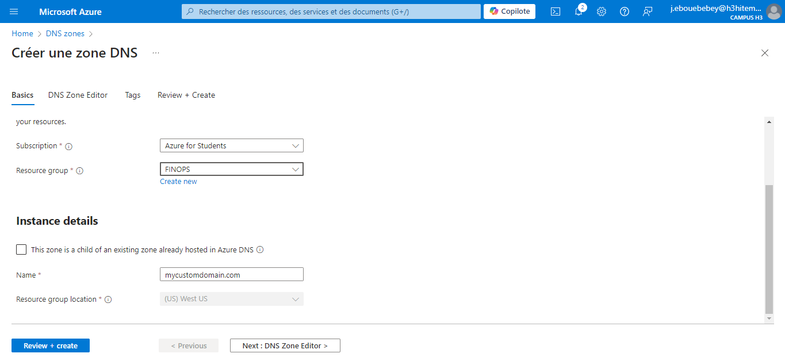
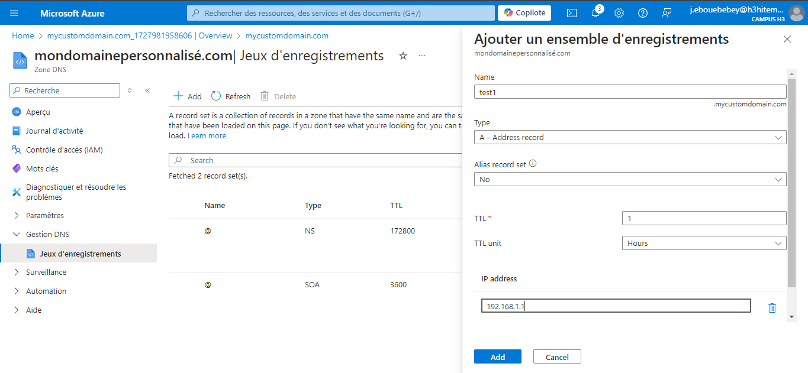
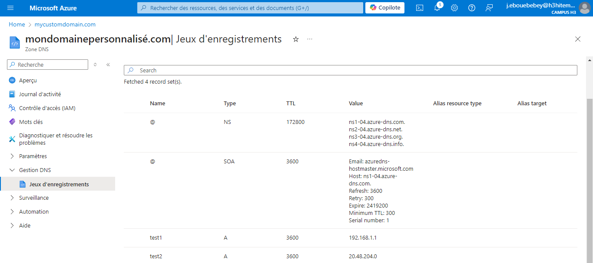

# Lab 14: Configuring Azure DNS and Custom Domains
## Step 1: Create an Azure DNS Zone
- Create a DNS Zone in Azure Portal:
    Name: mycustomdomain.com
    Resource Group: Select an existing resource group or create a new one.
    

- Azure CLI Command:
```bash
    az network dns zone create \
    --resource-group <nom_du_groupe> \
    --name mycustomdomain.com
```

## Step 2: Manage DNS Records for a Custom Domain
- Add DNS Records (A, CNAME, MX, etc.) in the DNS Zone:
    Add A Records for test1 and test2:
    
    
- Azure CLI Command to Add A Record
```bash
az network dns record-set a add-record \
  --resource-group <nom_du_groupe> \
  --zone-name mycustomdomain.com \
  --record-set-name "@" \
  --ipv4-address <adresse_ip_du_serveur>
```

## Step 3: Configure Domain Verification and Mapping for Azure Services
- Add a TXT Record for Domain Verification:
    Prove ownership of the domain by adding a TXT record.
- Azure CLI Command to Add TXT Record
```bash
    az network dns record-set txt add-record \
    --resource-group <nom_du_groupe> \
    --zone-name mycustomdomain.com \
    --record-set-name "@" \
    --value "azure-site-verification=<verification_code>"
```

## Step 4: Implement DNS Aliases (CNAME) and Record Sets
- Create a CNAME Record for an Alias DNS:
    Add CNAME Record for www alias
    
- Azure CLI Command to Add CNAME Record
```bash
    az network dns record-set cname set-record \
    --resource-group <nom_du_groupe> \
    --zone-name mycustomdomain.com \
    --record-set-name "www" \
    --cname mycustomdomain.com
```