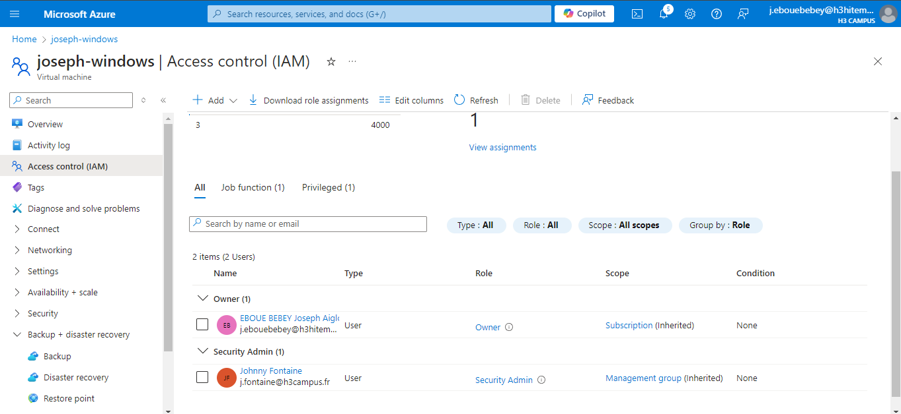
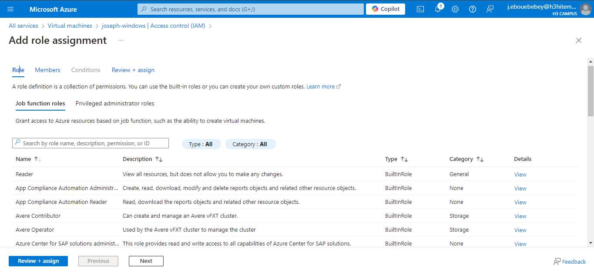
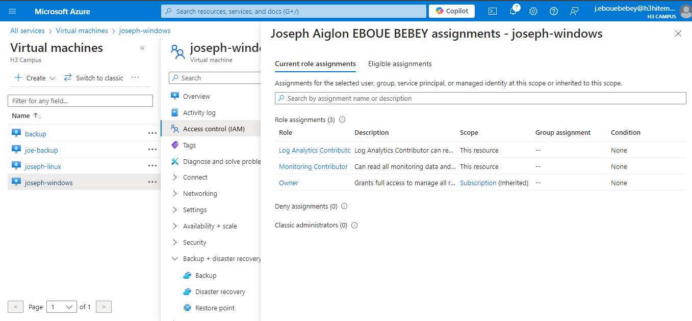
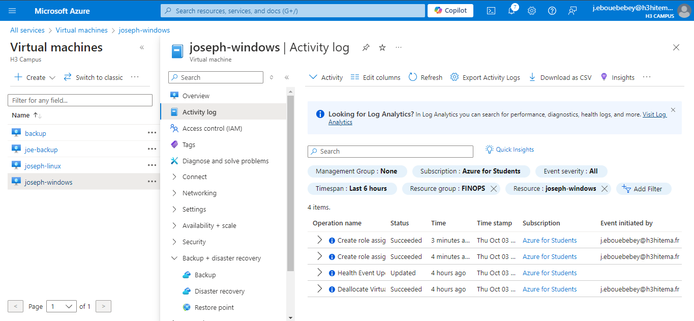

# Lab 16: Managing Role-Based Access Control (RBAC)

## Step 1 : Assign built-in roles to users and groups.
- Assign a Built-in Role in Access Control (IAM):
    Navigate to Access Control (IAM) in the Azure Portal for your desired resource (subscription, resource group, etc.).
    Click on + Add and then select Add role assignment.
    Choose a built-in role such as Owner, Contributor, or Reader.
    Select the user or group to which you want to assign the role.
    Click Save to finalize the role assignment.
    

- Azure CLI Command to Assign a Built-in Role:
```bash
    az role assignment create \
    --assignee <user_email_or_object_id> \
    --role "Contributor" \
    --scope /subscriptions/<subscription_id>/resourceGroups/<resource_group_name>
```
## Step 2 : Create custom roles with specific permissions.
- Create a Custom Role in Access Control (IAM):
    In the Azure Portal, go to Access Control (IAM).
    Click on + Add and select Add custom role.
    Fill in the role name and description.
    Specify the permissions that the role will have.
    
    

- Example JSON for a Custom Role:
```bash
    {
    "Name": "Custom VM Operator",
    "IsCustom": true,
    "Description": "Can manage VMs except for permissions",
    "Actions": [
        "Microsoft.Compute/virtualMachines/start/action",
        "Microsoft.Compute/virtualMachines/restart/action",
        "Microsoft.Compute/virtualMachines/read"
    ],
    "AssignableScopes": ["/subscriptions/<subscription_id>"]
    }
```
- Azure CLI Command to Create a Custom Role:
```bash
    az role definition create --role-definition '{
    "Name": "Custom VM Operator",
    "IsCustom": true,
    "Description": "Can manage VMs except for permissions",
    "Actions": [
        "Microsoft.Compute/virtualMachines/start/action",
        "Microsoft.Compute/virtualMachines/restart/action",
        "Microsoft.Compute/virtualMachines/read"
    ],
    "AssignableScopes": [
        "/subscriptions/<subscription_id>"
    ]
    }'
```
## Step 3 : Test access levels for different roles.
- Test Access Levels:
    Log in with users assigned different roles (e.g., Owner, Contributor, Reader).
    Attempt various actions on Azure resources to verify their access levels:
        A Reader should only be able to view resources.
        A Contributor should be able to create and manage resources, but not delete them if limited.
        An Owner should have full access, including management of permissions.
- Use Azure CLI to Test Access
    Log in with the specific user account:
```bash
    az login --username <user_email>
```
- Attempt to perform an action (e.g., start a virtual machine):
```bash
    az vm start --name <vm_name> --resource-group <resource_group>
```
## Step 4 : Audit access using activity logs.
- Audit Access with Activity Logs:
    In the Azure Portal, go to Monitor > Activity Log.
    Apply filters for the specific subscription and time range.
    Review the logs to see actions performed by users, including role assignments and resource modifications.
    

- Azure CLI Command to View Activity Logs:
```bash
    az monitor activity-log list \
    --resource-group <resource_group_name> \
    --start-time <start_time> \
    --end-time <end_time> \
    --max-events 50
```