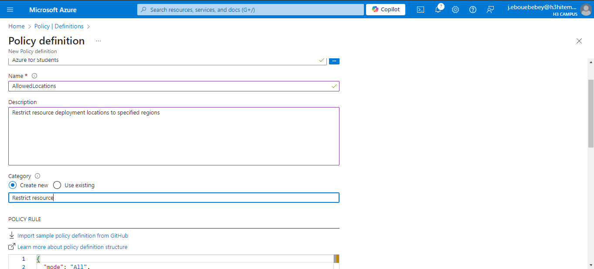
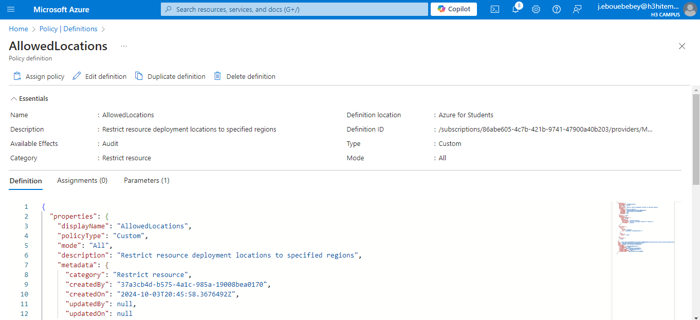
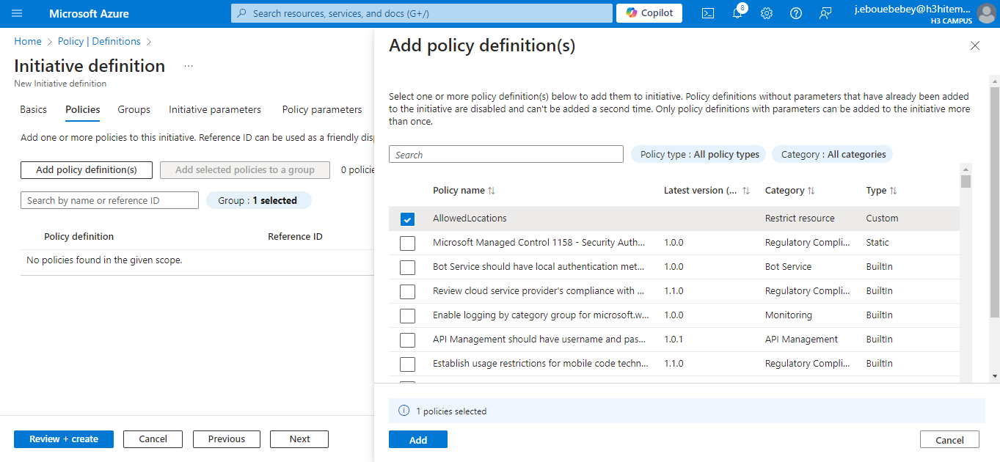
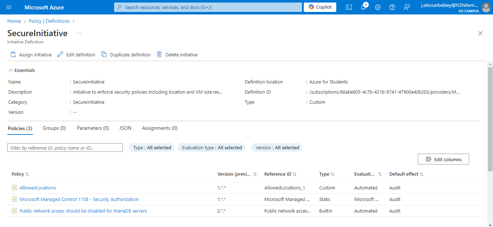
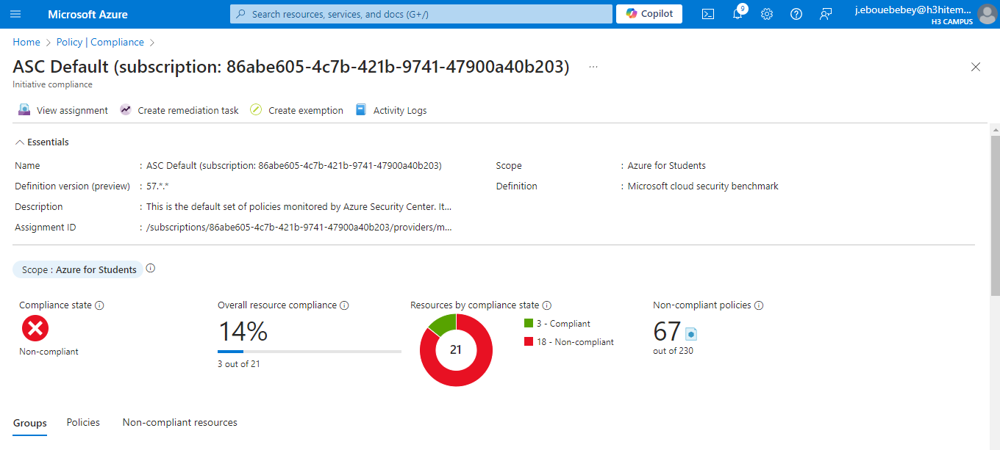
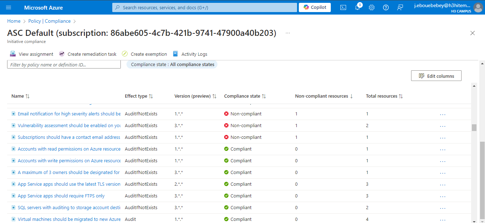

# Lab 17: Implementing Azure Policy and Governance

## Step 1 : Create and assign Azure Policies to enforce compliance.
- Create and Assign an Azure Policy to Restrict Resource Locations:
    Navigate to Azure Policy
    Create a New Policy
    
    

- Azure CLI Command to Create the Policy Assignment
```bash
    az policy assignment create \
    --name "AllowedLocations" \
    --policy "/providers/Microsoft.Authorization/policyDefinitions/<policy_id>" \
    --params '{"allowedLocations": {"value": ["East US", "West US"]}}' \
    --scope "/subscriptions/<subscription_id>"
```

## Step 2 : Use initiatives to group multiple policies.
- Create an Initiative to Group Policies
    Navigate to Initiatives
    Fill in Initiative Details
    Add Policies to the Initiative
    Click "Save" to create the initiative
    
    
    
- Azure CLI Command to Create the Initiative
```bash
    az policy set-definition create \
    --name "SecureInitiative" \
    --definitions '[{"policyDefinitionId": "/providers/Microsoft.Authorization/policyDefinitions/<policy1_id>"},{"policyDefinitionId": "/providers/Microsoft.Authorization/policyDefinitions/<policy2_id>"}]' \
    --params '{"allowedLocations": {"value": ["East US", "West US"]}}'
```

## Step 3 : Remediate non-compliant resources.
- Remediate Non-Compliant Resources
    Check Compliance Status
    Remediation Options
    
- Azure CLI Command to Create a Remediation
```bash
    az policy remediation create \
    --name "RemediateNonCompliantResources" \
    --policy-assignment "/subscriptions/<subscription_id>/providers/Microsoft.Authorization/policyAssignments/<policy_assignment_id>" \
    --resource-discovery-mode ReEvaluateCompliance
```

## Step 4 : Analyze compliance reports
- Analyze Compliance Reports
    Navigate to Compliance Reports
    Export Compliance Data (if needed)
    
