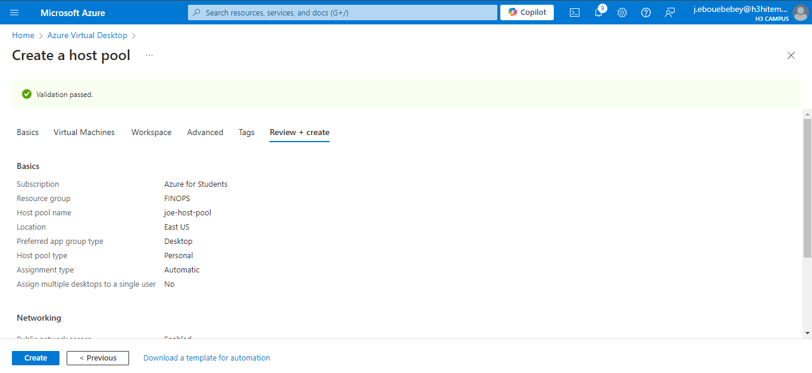
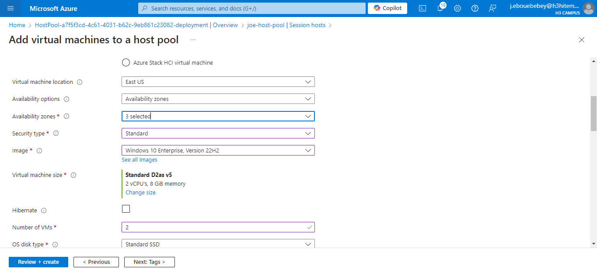
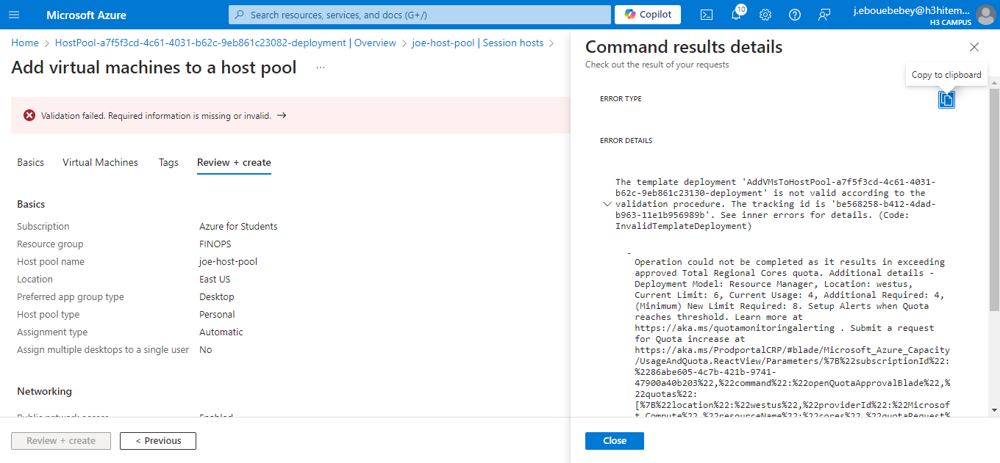

# Lab 18: Configuring Azure Virtual Desktop

## Step 1 : Set up Azure Virtual Desktop environment
#### Create a host pool to manage user sessions effectively within the Azure Virtual Desktop environment
- Navigate to the Azure Portal and search for "Azure Virtual Desktop."
- Click on "Host pools" and then select "+ Create"
- Fill in your required details
- Click "Review + create" and then "Create."
    
- Azure CLI Command
```bash
    az desktopvirtualization hostpool create \
    --resource-group <nom_du_groupe> \
    --name <nom_du_hostpool> \
    --location <region> \
    --friendly-name "Host Pool Lab18" \
    --description "Host Pool for Azure Virtual Desktop Lab"
```
## Step 2 : Configure host pools, session hosts, and workspaces
- Add Session Hosts (Virtual Machines): Create session hosts to host user sessions
    Go to your created host pool and click on "Session hosts"
    Select "+ Add" to create session hosts
    Configure the following
        VM Name: <session_host_name> (e.g., AVDSessionHost1)
        VM Size: Choose an appropriate size based on your workload (e.g., Standard_DS2_v2).
        Image: Select a Windows 10 or Windows Server image (e.g., Windows 10 Enterprise).
        Admin Username and Password: Set up credentials for admin access.
    Click "Create" to provision the VM
    
    

- Azure CLI Command
```bash
    az vm create \
    --resource-group <nom_du_groupe> \
    --name <session_host_name> \
    --image win10-21h2-pro \
    --admin-username <admin_username> \
    --admin-password <YourPassword> \
    --size Standard_DS2_v2 \
    --vnet-name <vnet_name> \
    --subnet <subnet_name>
```
- Create a Workspace: Group published desktops and applications for user access
    In Azure Virtual Desktop, click on "Workspaces" and select "+ Create."
    Fill in your following details
    Click "Review + create" and then "Create."
- Azure CLI Command:
```bash
    az desktopvirtualization applicationgroup create \
    --resource-group <nom_du_groupe> \
    --host-pool-name <nom_du_hostpool> \
    --name <nom_du_workspace> \
    --location <region> \
    --friendly-name "Workspace Lab18" \
    --description "Workspace for Virtual Desktop Applications"
```

## Step 3 : Publish remote desktop applications.
- Publish Applications : make specific applications available to users in the Azure Virtual Desktop environment. 
    Navigate to your workspace and click on "Applications."
    Click on "+ Add" to publish a new application
    Fill in the application details
    Click "Add" to publish the application
- Azure CLI Command
```bash
    az desktopvirtualization application create \
    --resource-group <nom_du_groupe> \
    --application-group-name <nom_du_workspace> \
    --name Notepad \
    --application-protocol RDP \
    --path "C:\Windows\System32\notepad.exe"
```

## Step 4 : Connect to the virtual desktops as a user.
- User Connectivity: Allow users to connect to the Azure Virtual Desktop environment
    Assign users to the workspace by navigating to the "Users" section in Azure Virtual Desktop.
    Click on "+ Add" to include users (ensure users have appropriate licenses).
    Users can connect via the Remote Desktop Client or the web client at https://rdweb.wvd.microsoft.com/webclient.
    Share the connection information with the users, including any necessary credentials.
- Azure CLI Command:
```bash
    az desktopvirtualization user add \
    --resource-group <nom_du_groupe> \
    --workspace-name <nom_du_workspace> \
    --user-principal-name <user_email>
```
