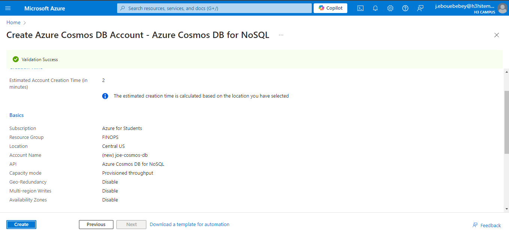
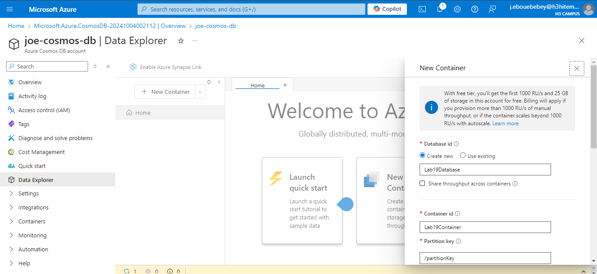
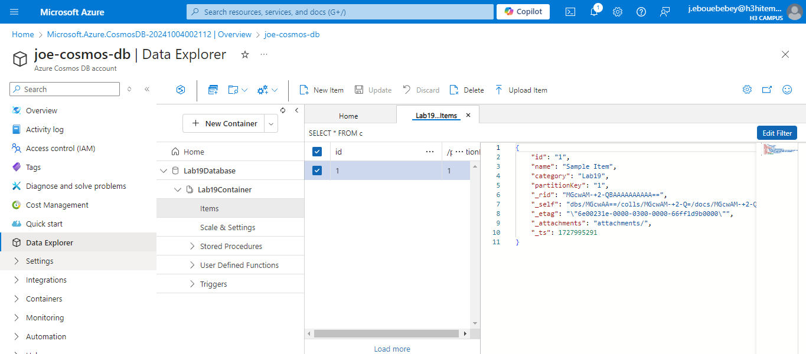
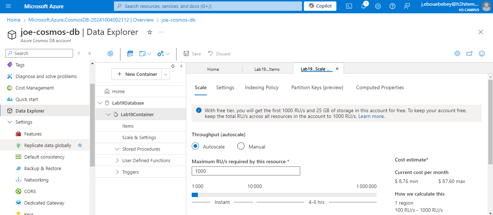
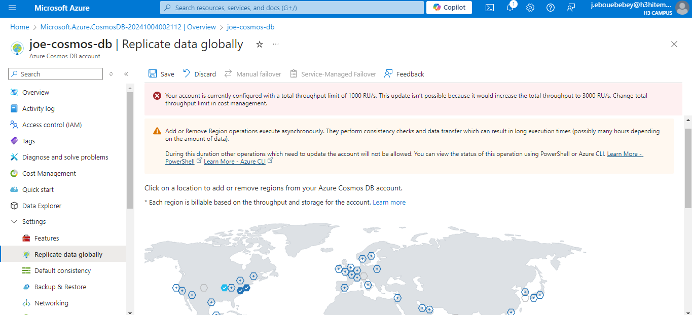

# Lab 19: Implementing Azure Cosmos DB

## Step 1 : Create a Cosmos DB account with a chosen API (SQL, MongoDB, etc.)
#### Create a Cosmos DB account in Azure with your chosen API (SQL, MongoDB, Cassandra, etc.)
On Azure Portal
- Search for "Azure Cosmos DB" and click "+ Create"
- Choose the API you want to use, such as SQL, MongoDB, Cassandra, Gremlin, or Table
- Configure with required setting


#### Azure CLI Command
```bash
    az cosmosdb create \
    --name <account_name> \
    --resource-group <resource_group_name> \
    --kind <API_name> \
    --locations regionName=<region> \
    --default-consistency-level "Session"
```

## Step 2 : Insert and query data using the Data Explorer
#### Insert and query data in your Cosmos DB database via the Data Explorer
- Go to the Cosmos DB account you created
- Click on "Data Explorer" from the sidebar.
- Select "+ New Container" to create a database and container
- Once the container is created, click "New Item" and insert a JSON document



#### Azure CLI Command
```bash
    az cosmosdb sql database create \
    --account-name <account_name> \
    --resource-group <resource_group_name> \
    --name <database_name>

    az cosmosdb sql container create \
    --account-name <account_name> \
    --resource-group <resource_group_name> \
    --database-name <database_name> \
    --name <container_name> \
    --partition-key-path "/partitionKey"
```
## Step 3 : Configure throughput and partitioning
#### Configure throughput and partitioning to optimize performance and scaling
- In your Cosmos DB account, navigate to the "Settings" section
- Select your database or container
- Under "Settings", configure the Throughput by setting Request Units (RUs)
- For Partitioning, ensure that your partition key (e.g., /partitionKey) is set correctly when creating the container.
    

#### Azure CLI Command
```bash
    az cosmosdb sql container throughput update \
    --account-name <account_name> \
    --resource-group <resource_group_name> \
    --database-name <database_name> \
    --name <container_name> \
    --throughput 1000
```
## Step 4 : Implement Global Distribution
#### Distribute your Cosmos DB data globally to improve latency and availability
- In your Cosmos DB account, click on "Replicate data globally" under the "Settings" section
- Select additional regions to add to your Cosmos DB account (e.g., West Europe, Southeast Asia)
- Choose the failover priority and read/write regions for global distribution
- Click "Save" to apply the global distribution settings.


#### Azure CLI Command
```bash
    az cosmosdb update \
    --name <account_name> \
    --resource-group <resource_group_name> \
    --locations regionName=<region1> failoverPriority=0 \
    --locations regionName=<region2> failoverPriority=1
```
