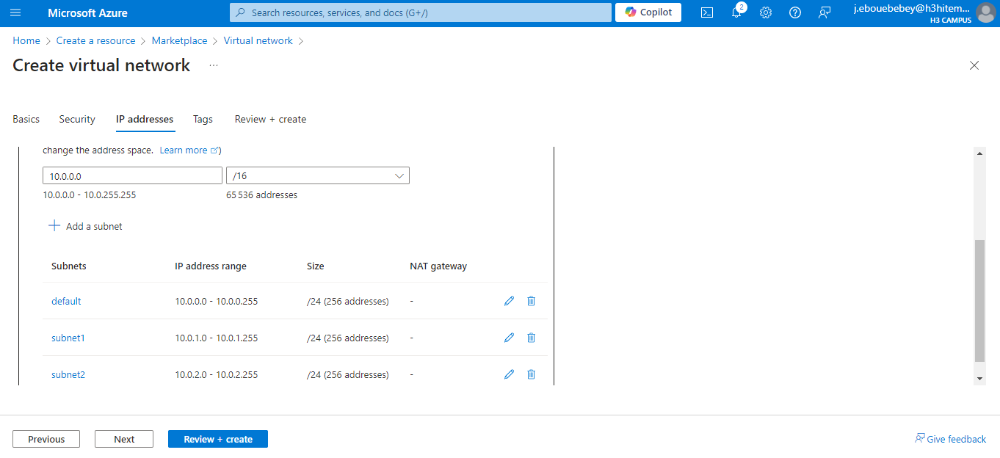
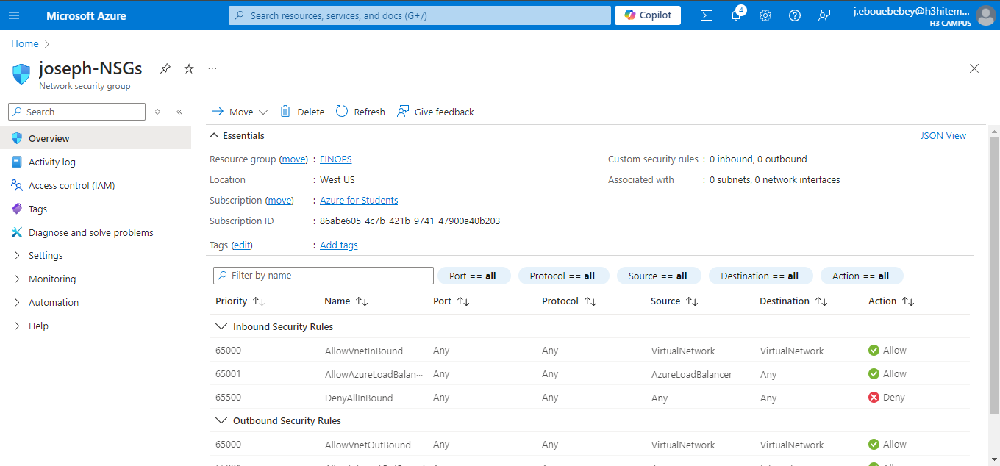
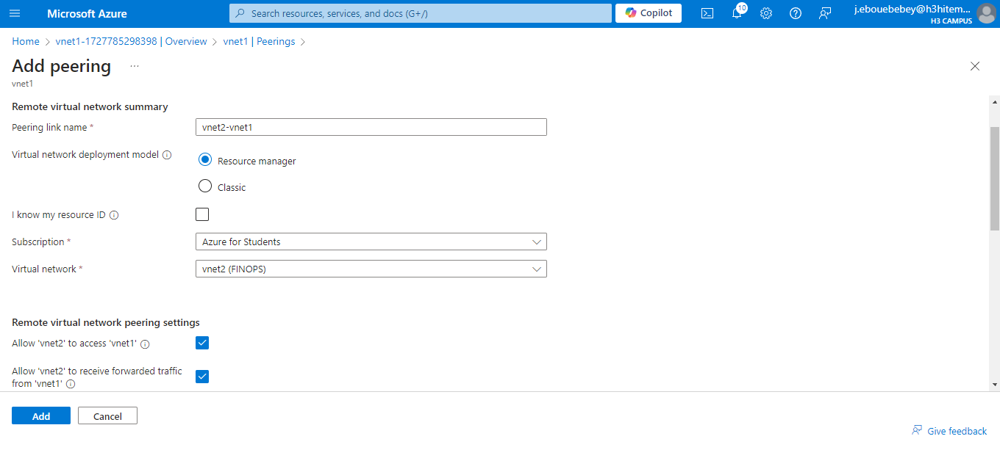

# Lab 2 : Implementing Azure Virtual Networks
## Step 1 : Create a Virtual Network (VNet) with Multiple Subnets
### Create a Virtual Network with multiple subnets
In the Subnets tab, i created 3 subnets:
 
#### On CLI
```bash
az group create --name vnet1 --location eastus
```
Create Virtual Network
```bash
az network vnet create \
  --name vnet1 \
  --resource-group FINOPS \
  --address-prefix 10.0.0.0/16 \
  --location eastus \
  --subnet-name subnet1 \
  --subnet-prefix 10.0.1.0/24
```
add subnet
```bash
az network vnet create \
az network vnet subnet create \
  --resource-group FINOPS \
  --vnet-name vnet1 \
  --name subnet2 \
  --address-prefix 10.0.2.0/24
```
## Step 2 : Set up Network Security Groups (NSGs) to Control Inbound and Outbound Traffic
Creation of network Security Group with inbound and Outband rules  
 
### On CLI
```bash
az network nsg create \
  --resource-group FINOPS \
  --name joseph-NSGs
```
#### Add Inbound Security Rule
#### Associate NSG with a Subnet

## Step 3 : Deploy VMs into Specific Subnets
This steps goes with Lab 1 (creation of VMs)

## Step 4 : Configure VNet Peering Between Two VNets
Peering allows VMs in different VNets to communicate with each other.
 
### On CLI
```bash
az network vnet peering create \
  --name VNet1-to-VNet2 \
  --resource-group FINOPS \
  --vnet-name VNet1 \
  --remote-vnet VNet2 \
  --allow-vnet-access
```
```bash
az network vnet peering create \
  --name VNet2-to-VNet1 \
  --resource-group FINOPS \
  --vnet-name VNet2 \
  --remote-vnet VNet1 \
  --allow-vnet-access
```