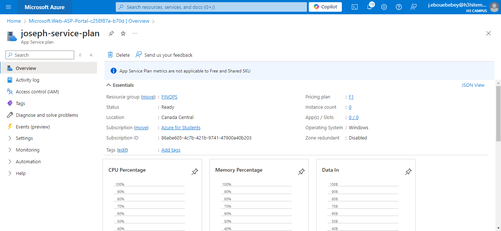
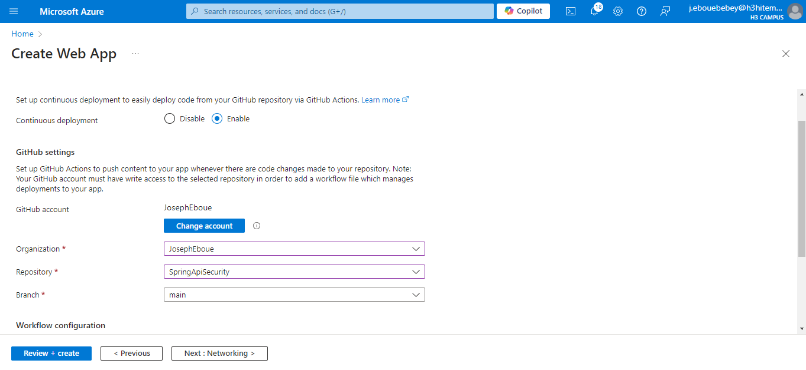
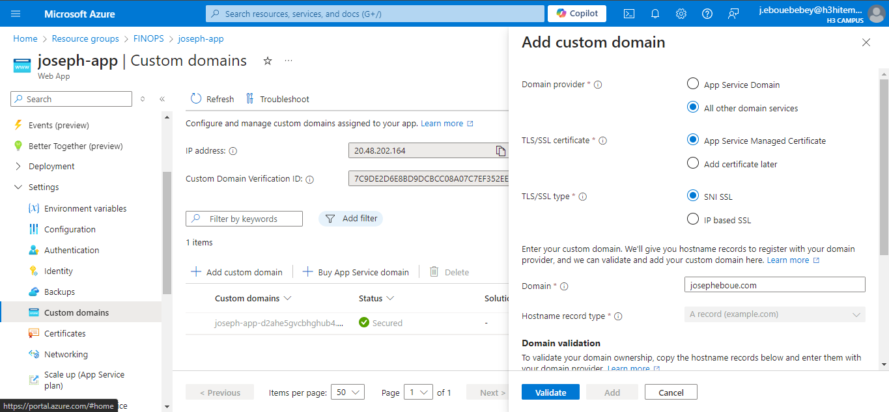

# Lab 2 : Implementing Azure Virtual Networks
An App Service Plan defines the region, instance size, and pricing tier for hosting your web app.
## Step 1 : Create an Azure App Service Plan

### On CLI

```bash
az appservice plan create \
  --name joseph-service-plan \
  --resource-group FINOPS \
  --sku B1 \
  --location eastus \
  --is-linux
```

## Step 2 : Deploy a Web Application Using Azure App Service
Deploy a web app from my github repositories


### On CLI 
Create Web App
```bash
az webapp create \
  --name SpringApiSecurity \
  --resource-group FINOPS \
  --plan joseph-service-plan
```
Deploy Code to the Web App via Local Git:

```bash
az webapp create \
  --name joseph-app \
  --resource-group FINOPS \
  --plan joseph-service-plan
```
```bash
git remote add azure <deployment-url>
git push azure main
```

## Step 3 : Configure Custom Domains and SSL Certificates
To configure custom domains needed some premium access, so it remained unchanged


## Step 4 : Implement Deployment Slots for Staging and Production
As step 4, it requires an upgrade to premium plan to add slots