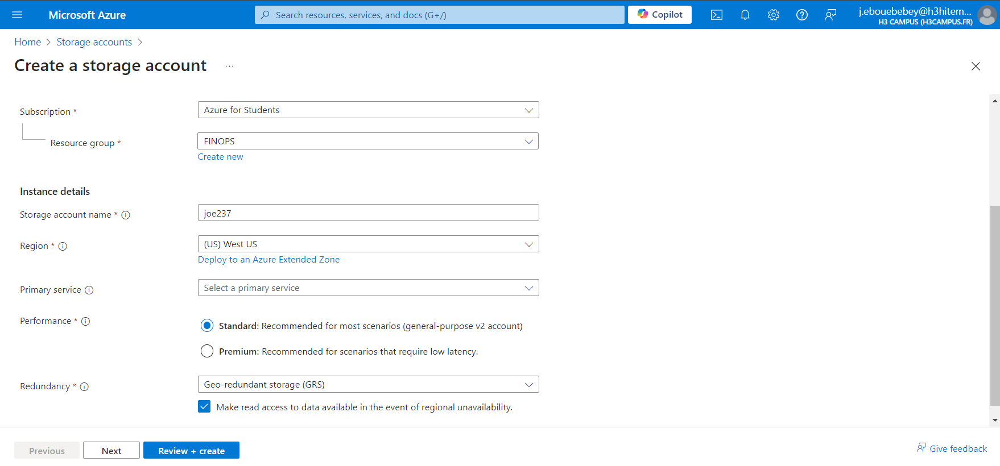
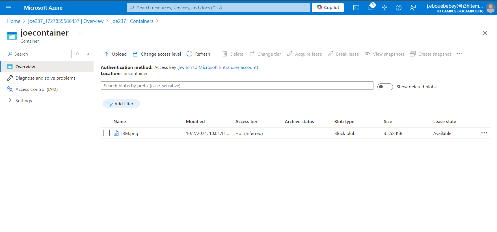
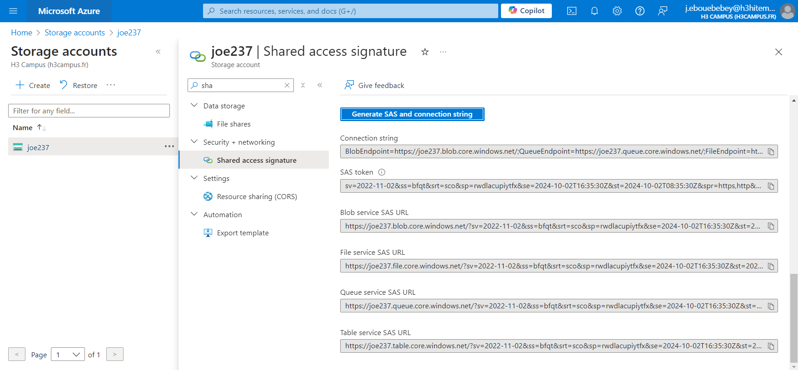

# LAB 4 - Managing Azure Storage Accounts and Blobs
## Create a Storage Account with different replication options.

In the search bar, i created a search a Storage account named "joe237"
On the Replication section based on your redundancy needs, i choosed GRS (Geo-Redundant Storage)


## Upload and Manage Blobs Using Azure Portal and Azure CLI
### Using Azure Portal
On Azure portal, i started by creating a new blob container and i uploaded a new an image


### Using Azure CLI
In the Azure cloud shell. In order to: 
- Create blob container
```bash
az storage container create --name joecontainer --account-name joe237 --auth-mode login
```
- Upload blob
```bash
az storage blob upload --container-name joecontainer --file C:/Users/baigl/OneDrive/Pictures/IBM.png --name IBM.png --account-name joe237 --auth-mode login
```
- List blobs in the container 
```bash
az storage blob list --container-name joecontainer --account-name joe237 --output table
```

## Set Up Shared Access Signatures (SAS) for Secure Access
A Shared Access Signature (SAS) provides secure, temporary access to resources in the storage account without exposing the account key.
### Using Azure Portal
On the the storage account security settings i generated a new SAS

### Using Azure CLI
- Generate SAS for a Blob Container
```bash
az storage container generate-sas --name joecontainer --account-name joe237 --permissions rwl --expiry 2024-12-31T23:59Z --auth-mode login --output tsv
```

## Implement Lifecycle Management Policies
### Using Azure Portal
Lifecycle management policies allow to automate blob management by moving or deleting blobs based on their age.

### Using Azure CLI
- Create a JSON file (lifecycle-policy.json) that defines the policy
```bash
{
  "rules": [
    {
      "enabled": true,
      "name": "MoveOldBlobs",
      "type": "Lifecycle",
      "definition": {
        "filters": {
          "blobTypes": ["blockBlob"],
          "prefixMatch": ["joecontainer/"]
        },
        "actions": {
          "baseBlob": {
            "tierToCool": {
              "daysAfterModificationGreaterThan": 30
            },
            "delete": {
              "daysAfterModificationGreaterThan": 365
            }
          }
        }
      }
    }
  ]
}
```
-   Apply Lifecycle Policy
```bash
az storage account management-policy create --account-name joe237 --policy @lifecycle-policy.json
```

