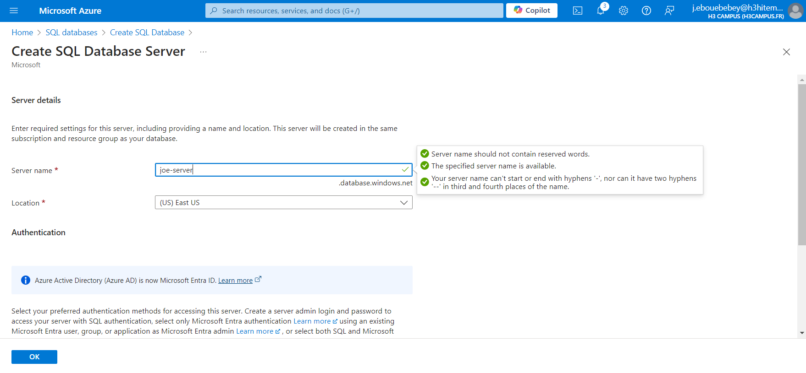
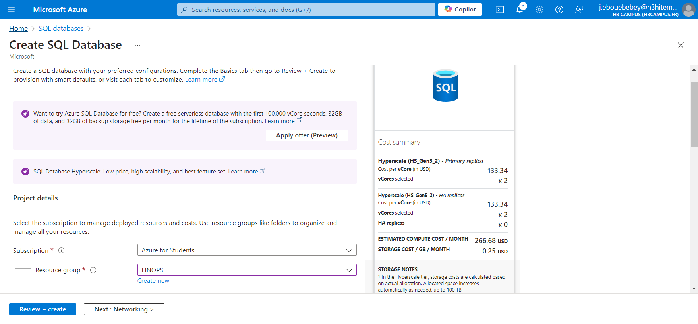
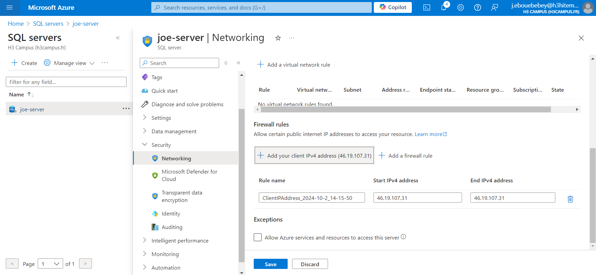
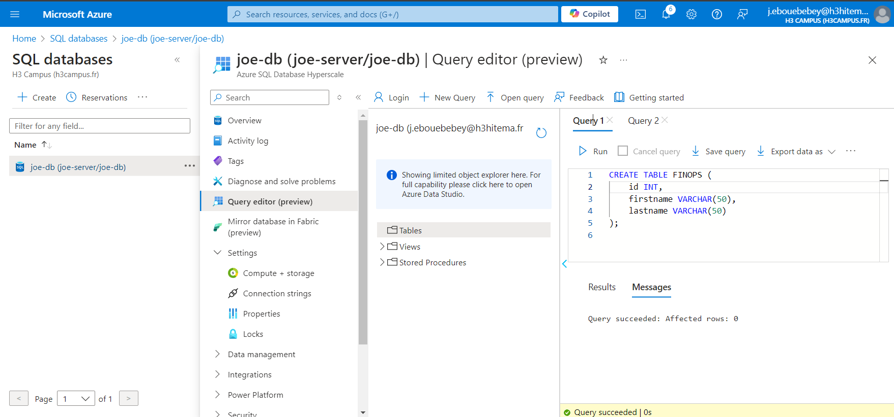

# Lab 5 : Implementing Azure SQL Databases
## Step 1 : Deploy an Azure SQL Database Instances
Create new SQL database on the Azure portal
- To create the SQL database, an SQL server should be created 
 
- SQL Database creation
 

### using Azure CLI
- Create a SQL Server
```bash
az sql server create \
  --name joe-server \
  --resource-group FINOPS \
  --location eastus \
  --admin-user joe-server \
  --admin-password password@123!
```
- Create a SQL Database
```bash
az sql db create \
  --resource-group FINOPS \
  --server joe-server \
  --name joe-db \
  --service-objective S0
```
## Step 2 : Configure Firewall Settings to Allow Client Access

### using Azure CLI
- Add Your Client IP Address to Firewall Rules:
```bash
az sql server firewall-rule create \
  --resource-group FINOPS \
  --server joe-server \
  --name ClientIPAddress_2024-10-2_14-15-50 \
  --start-ip-address 46.19.107.31 \
  --end-ip-address 46.19.107.31
```
- Add Your Client IP Address to Firewall Rules:
```bash
az sql server firewall-rule create \
  --resource-group FINOPS \
  --server joe-server \
  --name ClientIPAddress_2024-10-2_14-15-50 \
  --start-ip-address 46.19.107.31 \
  --end-ip-address 46.19.107.31
```

## Step 3: Import Data into the Database
Create a new table in the database either that uploading 


## Step 4: Implement Geo-Replication for High Availability
### sing Azure CLI
Configure Active Geo-Replication
```bash
az sql db replica create \
  --resource-group FINOPS \
  --server joe-server \
  --name joe-db \
  --partner-server joe-server2 \
  --partner-resource-group FINOPS \
  --location westus
```
Monitor replication
```bash
az sql db replica list-links \
  --resource-group FINOPS \
  --server joe-server \
  --name joe-db
```