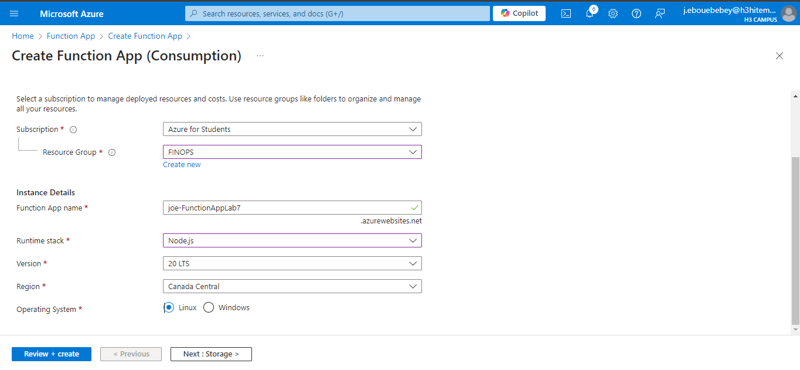
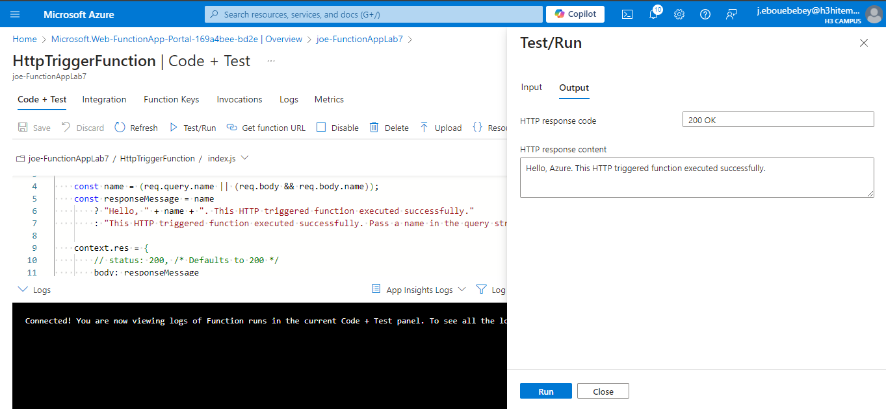
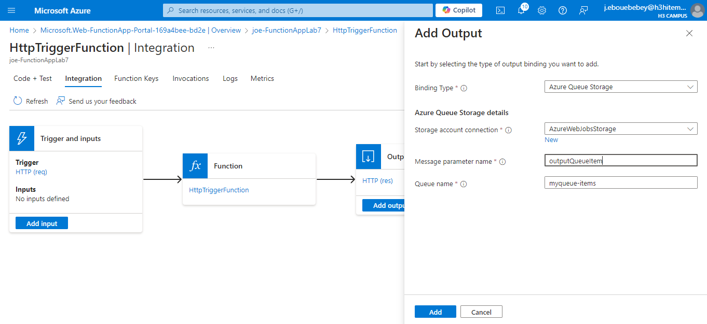
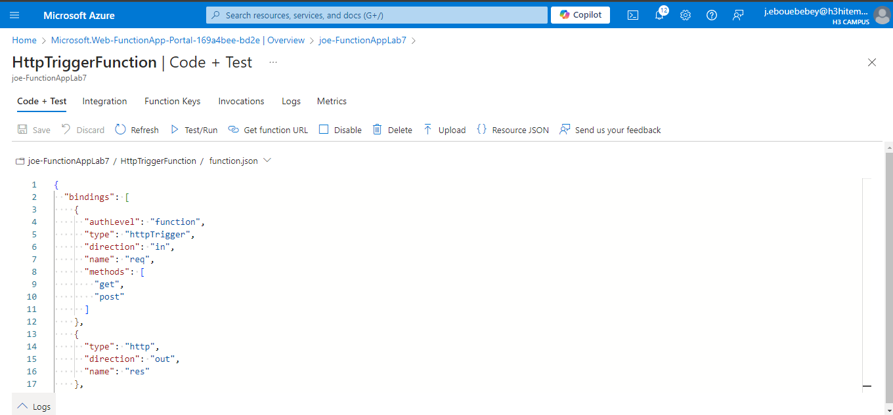
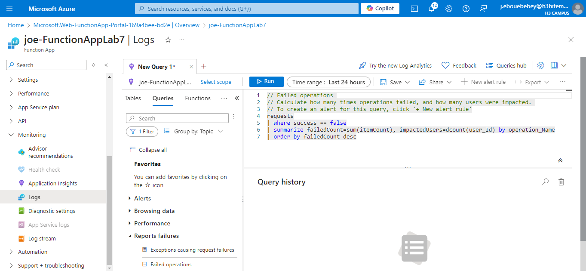

# Lab 7: Implementing Azure Functions

## Step 1 : Create an Azure Function App
- Set up an Azure Function App to host serverless functions
    In the Azure Portal, search for "Function App" and click "+ Create"
    Fill in required details
    Click "Review + create", then "Create"
    

- Azure CLI Command
```bash
    az functionapp create \
    --resource-group <resource_group_name> \
    --consumption-plan-location <region> \
    --runtime <runtime> \
    --name <function_app_name> \
    --storage-account <storage_account_name>
```
## Step 2 : Develop a serverless function triggered by an HTTP request
- Develop a simple HTTP-triggered function
    After creating the Function App, go to the Function App and click on "Functions"
    Select "+ Create", and choose "HTTP Trigger" as the template
    Name the function (e.g., HttpTriggerFunction) and set the authorization level (e.g., Function or Anonymous)
    In the function editor, modify the code if necessary
    

    Save and test the function by clicking "Test/Run" or use the provided URL to trigger the function with a browser or Postman.
    

- Azure CLI Command:
```bash
    func init <function_app_folder> --worker-runtime <runtime>
    func new --name HttpTriggerFunction --template "HTTP trigger"
    func start
```
## Step 3 : Integrate the function with Azure Storage or Azure Queue
- Integrate the function to interact with Azure Storage (Blob, Queue, or Table)
    Go to "Integrate" in your Function App
    Choose a trigger or output binding. For this step, you can add an Azure Queue Storage Output
    
    In the Bindings section, add an Output Binding to Azure Storage
    
    In the function code, add the logic to write to the queue
```bash
    module.exports = async function (context, req) {
        context.bindings.outputQueueItem = req.body; // Add to queue
        context.res = {
            body: "Item added to queue!"
        };
    };
```
- Azure CLI Command to Create Storage Account and Queue
```bash
    az storage account create \
    --name <storage_account_name> \
    --resource-group <resource_group_name> \
    --location <region> \
    --sku Standard_LRS

    az storage queue create \
    --name <queue_name> \
    --account-name <storage_account_name>
```
## Step 4 : Monitor function performance and logs
- Use monitoring and logs to observe function execution and performance
    In the Function App, go to the "Monitoring" section
    Click on "Logs" to see real-time log output from the function executions
    For performance metrics, go to "Application Insights" (if enabled during creation) to view
    You can also set up Alerts based on function metrics like execution failures or latency
    

- Azure CLI Command to Enable Application Insights
```bash
    az monitor app-insights component create \
    --app <app_insights_name> \
    --location <region> \
    --resource-group <resource_group_name>
```
