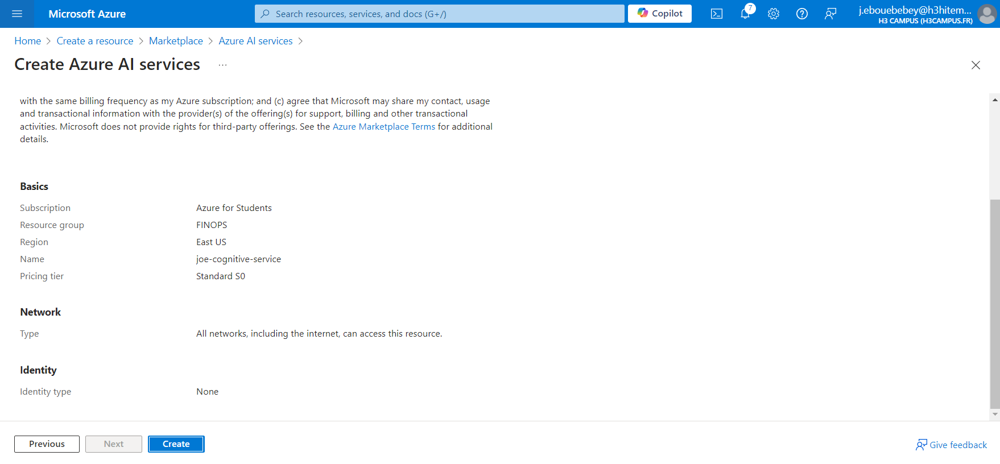
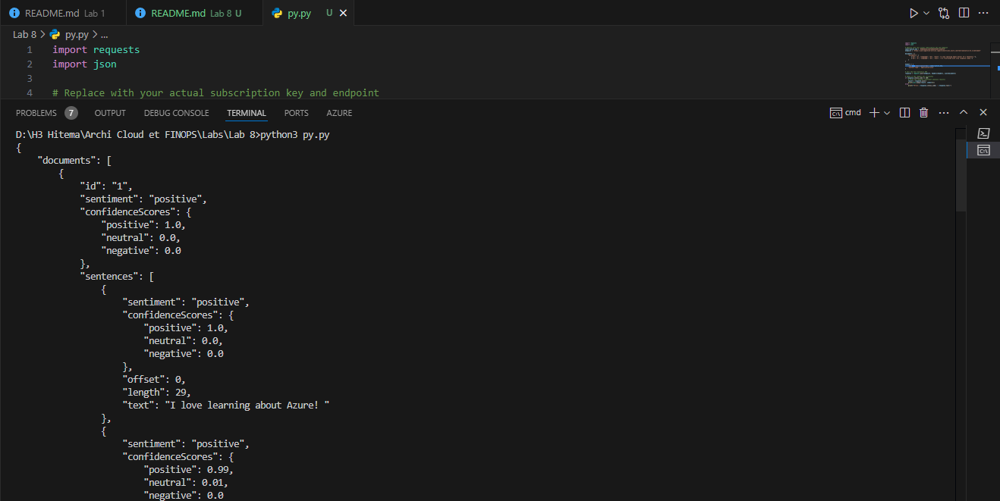
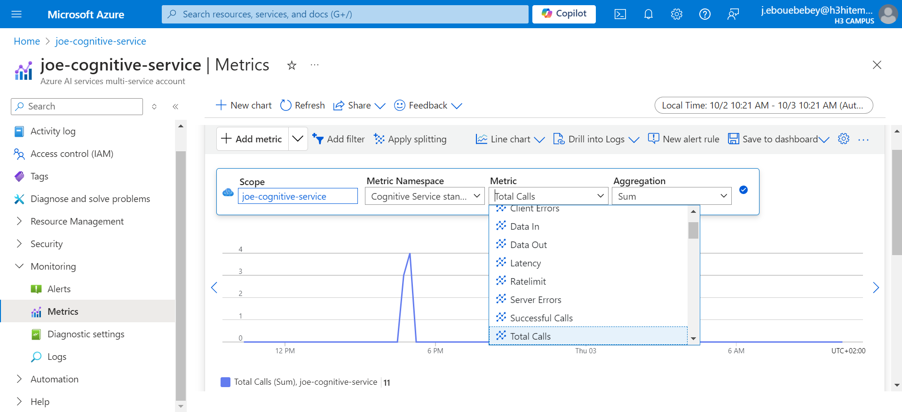
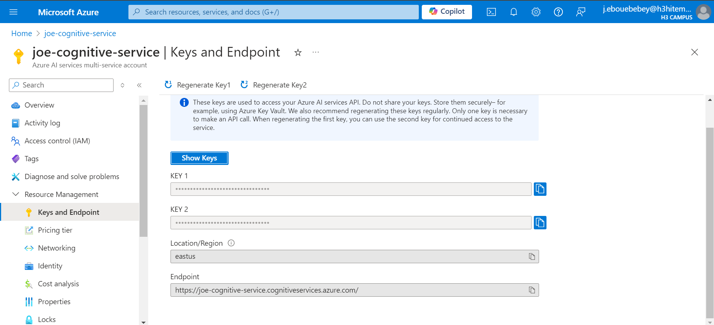

# Lab 8: Using Azure Cognitive Services

## Step 1: Create a Cognitive Services Resource
Azure Cognitive Services provides a set of AI tools that allow you to integrate intelligent features like language understanding, speech recognition, computer vision, and more into your applications.
 - Create a new Azure AI cognitive service with the name "joe-cognitive-service"
 

### using Azure CLI
```bash
az cognitiveservices account create \
  --name joe-cognitive-service \
  --resource-group FINOPS \
  --kind TextAnalytics \
  --sku S0 \
  --location eastus \
  --yes
```
## Step 2: Develop an Application that Uses the Text Analytics API
To interact with the Text Analytics API, i developed a simple application that calls the API endpoints.
- After setting up the environment, i created a python file inorder to test the cognitive service. Below is the python code and the result 
```bash
import requests
import json

# Replace with your actual subscription key and endpoint
subscription_key = '8508285aec1d47ad9a6f018fc13e8713' 
endpoint = 'https://joe-cognitive-service.cognitiveservices.azure.com/text/analytics/v3.1/sentiment'

documents = {
    "documents": [
        {"id": "1", "language": "en", "text": "I love learning about Azure! It's fantastic."},
        {"id": "2", "language": "en", "text": "I'm frustrated with slow response times."}
    ]
}

headers = {
    'Ocp-Apim-Subscription-Key': subscription_key,
    'Content-Type': 'application/json'
}

# Call the Text Analytics API
response = requests.post(endpoint, headers=headers, json=documents)

# Check if the request was successful
if response.status_code == 200:
    # Print the response (sentiment analysis results)
    result = response.json()
    print(json.dumps(result, indent=4))
else:
    print(f"Error: {response.status_code} - {response.text}")
```

## Step 3 : Analyze Sentiment and Key Phrases from Sample Text
As on step 2, a sample text was integrated for API analytics and i got the following results


## Step 4: Monitor API Usage and Manage Keys
Monitoring API usage and managing keys is important for security and managing costs.
### Monitor API Usage in Azure Portal
In the monitoring field of the cognitive API service, i  added new metrics in order to visualize how my API is used (like a metric of total calls, client errors, server errors etc...). Here below is an example of the total calls of my api in a certain period.

### Manage API Keys
Also to menage API keys for better security, 
There are 2 keys, Key 1 and Key 2. If you need to regenerate one of the keys (for security purposes), click Regenerate Key next to the key you want to refresh.
You can use Key 2 as a backup while regenerating Key 1, ensuring no downtime for your application.
