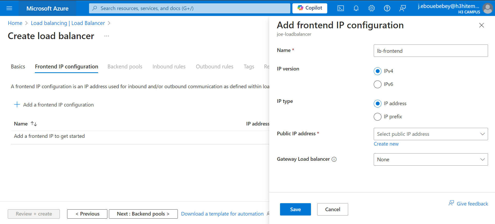

# Lab 9: Implementing Azure Load Balancer and Traffic Manager
## Step 1: Deploy Azure Load Balancer
The Azure Load Balancer helps distribute incoming traffic evenly across multiple VMs, improving application reliability and scalability.
### Deploy Load Balancer using Azure Portal
In this creation of the load balancer, i configured:
- Frontend IP address
- Backend pool
- Inbound load-balancing rules
- Health probe



### Deploy Load Balancer using Azure CLI
Configure Health Probes and Load Balancing Rules. 
```bash
az network lb probe create \
  --resource-group FINOPS \
  --lb-name joe-loadbalancer \
  --name lb-health-probe \
  --protocol tcp \
  --port 80 \
  --interval 5 \
  --threshold 2
```
```bash
az network lb rule create \
  --resource-group FINOPS \
  --lb-name joe-loadbalancer \
  --name lb-HTTP-rule \
  --frontend-ip-name lb-frontend \
  --backend-pool-name lb-backend-pool \
  --protocol tcp \
  --frontend-port 80 \
  --backend-port 80 \
  --probe-name b-health-probe
```

## Step 2: Set Up Azure Traffic Manager
Azure Traffic Manager enables DNS-based traffic routing to your application. This allows you to distribute traffic to multiple regions or route based on latency, performance, or priority.
### Create Traffic Manager Profile

### Add Endpoints to Traffic Manager

### Add traffic manager endpoint 
```bash
App1ResourceId=$(az webapp show --name $mywebappeastus --resource-group FINOPS --query id --output tsv)
az network traffic-manager endpoint create --name $mywebappeastus --resource-group FINOPS --profile-name joe-mytrafficmanager --type azureEndpoints --target-resource-id $App1ResourceId --priority 1 --endpoint-status Enabled
```

## Step 3: Test Failover Scenarios
Here i checked the domain name of the Traffic Manager profile and configured the primary endpoint to be unavailable. 

while accessing the DNS name below on my Azure portal, i noticed the web app is still available. It's because Traffic Manager sends the traffic to the failover endpoint.


```bash
az network traffic-manager profile show --name joe-mytrafficmanager --resource-group FINOPS --query dnsConfig.fqdn
```